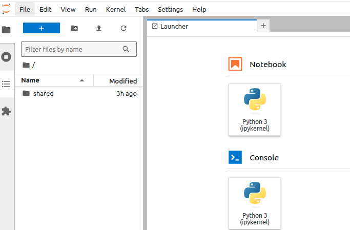
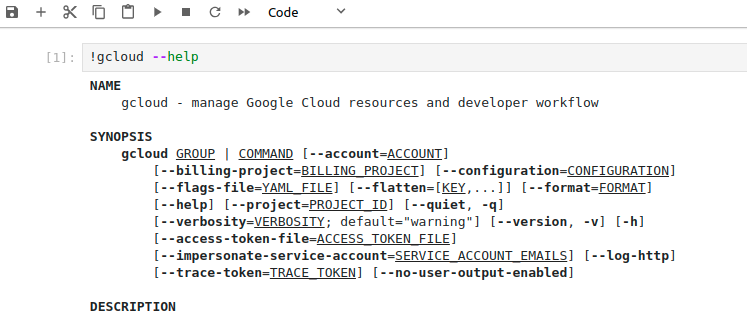

# Data Dev Jupyter Cloud 

This is a containerized Ubuntu image optimized for data engineering with a built-in Jupyter server and support for GCP Cloud SDK.


## Build the container

To build the container, run this in shell:
```shell
bash build.sh
```
and this will build the docker container called `data-dev-jupyter-cloud:v1` with the default password as `sigtica` for the jupyter server. If you wish you change your password, please alter the `Dockerfile` as follows:
```
ENV NOTEBOOK_PASSWORD=sha1:001573f70efc11f419c70fbe78b3af0e:12888e9468259b90ed82b3ab98fdeb2ec5f00116
```
and place `sha1:001573f70efc11f419c70fbe78b3af0e:12888e9468259b90ed82b3ab98fdeb2ec5f00116` with your choice of password, encrypted. 

You can encrypt your own password in python:
```python
def generate_sha1_hash(input_string):
    import hashlib
    import secrets
    # Generate a random salt
    salt = secrets.token_hex(8)
    # Hash the input string with the salt
    sha1 = hashlib.sha1((input_string + salt).encode()).hexdigest()
    # Construct the final hash in the desired format
    hashed_password = f"sha1:{salt}:{sha1}"
    return hashed_password

hashed_password = generate_sha1_hash("sigtica")
print(hashed_password)
```

## Running the container 

To run the container, run this in shell:
```shell
bash run.sh
```
and it will spin up a docker container using the image `data-dev-jupyter-cloud:v1` that you built earlier, available at http://localhost:8888, with a default password of `sigtica`. 

## Mounted volume

By design, `run.sh` mounts a `shared/` folder to this docker image. Everything you read or write in that folder will be reflected on your local machine as well. 




## GCP Cloud SDK support

This image has built-in support for using the GCP Cloud SDK to move files from and to Google Cloud Platform:



You can initialize Google Cloud SDK as follows:
```shell
gcloud init
```
then
```shell
gcloud auth login
```

After you authenticate, you must set up your GCP project credentials.
```shell
gcloud config set project $PROJECT_ID
```
where `PROJECT_ID` is the project ID of your project on GCP.


Then you can push or pull files from Google Cloud Storage, for example.
```shell
gsutil cp $LOCAL_FILE_PATH gs://$BUCKET_NAME/$DESTINATION_PATH
gsutil mv $LOCAL_FILE_PATH gs://$BUCKET_NAME/$DESTINATION_PATH
```
where you must define the parameters: `LOCAL_FILE_PATH`, `BUCKET_NAME`, `DESTINATION_PATH`.


## Built for cloud


